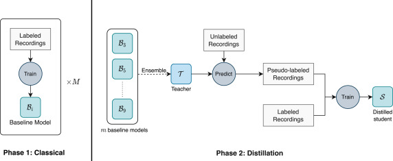

# Semi-Supervised Patient-Specific Automatic Sleep Classification using SeqSleepNet

Code associated with the paper "[Automatic sleep scoring using patient-specific ensemble models and knowledge distillation for ear-EEG data](https://www.sciencedirect.com/science/article/pii/S1746809422009508)" by [Kenneth Borup](https://github.com/Kennethborup), Preben Kidmose, Huy Phan, and Kaare Mikkelsen.

## Description



In this study we present a number of important contributions to the field of automatic sleep scoring:
- To our knowledge, this is the first study successfully leveraging unlabeled, personal data, which is likely to be important in long term sleep monitoring.
- We show that simple ensembles of 10 SeqSleepNet models trained independently improve predictive performance, and only differ by 0.04 in Cohen’s kappa compared to the best case scenario of two manual scorers.
- Despite no change in model architecture, we show that a single SeqSleepNet model trained with our semi-supervised distillation setup retains between 50% and 100% of the improvements obtained by ensemble models (of various size) when trained with personal data.

For more details see the [paper](https://www.sciencedirect.com/science/article/pii/S1746809422009508).

## Getting Started

### Dependencies

The required dependencies are listed in the requirements.txt file. To install the minimal dependencies, create a conda environment and install the dependencies:
```{bash}
conda env create --file environment.yml
```
For full environment use `environment_full.yml` instead.

### Executing program

A multitude of options are available for training and evaluating the models. The main script is `selftrain.py` and the options are available by running:
```{bash}
python selftrain.py --help  
```
An example of training a model with semi-supervised distillation on 5 first subjects is:
```{bash}
python selftrain.py \
    --seed 0 \
    --deterministic \
    --gpus 1 \
    --max_epochs 1500 \
    --learning_rate 1e-4 \
    --weight_decay 1e-3 \
    --early_stopping_delay 700 \
    --normalize \
    --cv_weights_folders <insert path to teacher weights> \
    --ensemble_pseudo_labels \
    --only_test_pseudo_subjects \
    --cv_range 5 \
```

Models can be evaluated using the `evaluate.py` script.

## Citation
If you find this repository and/or paper useful, please cite the paper:
```
@article{BORUP2023104496,
  title = {Automatic sleep scoring using patient-specific ensemble models and knowledge distillation for ear-EEG data},
  journal = {Biomedical Signal Processing and Control},
  volume = {81},
  pages = {104496},
  year = {2023},
  issn = {1746-8094},
  doi = {https://doi.org/10.1016/j.bspc.2022.104496},
  url = {https://www.sciencedirect.com/science/article/pii/S1746809422009508},
  author = {Kenneth Borup and Preben Kidmose and Huy Phan and Kaare Mikkelsen},
}
```
